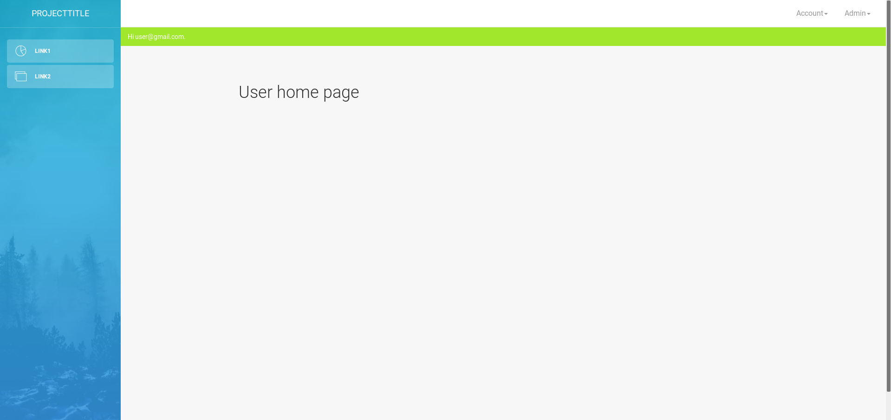

# base-flask-mvc

Fire up a new project with user registration and a working flask mvc.

## Quick start

`$ git clone https://github.com/ritchie46/base-flask-mvc.git`

`$ cd base-flask-mvc`

**Create and activate a new conda environment with the appropriate modules**

`$ conda env create -f environment.yml`

`$ source activate base-flask-mvc`

**Create a new database table**

`$ python ./app/db/db_create_new.py`

**Run application**

`$ python ./app/run.py`

* username: user@gmail.com
* password: testpassword

## Setup properly

Change the file `app/instance/flask.cfg` properly to suit your needs.